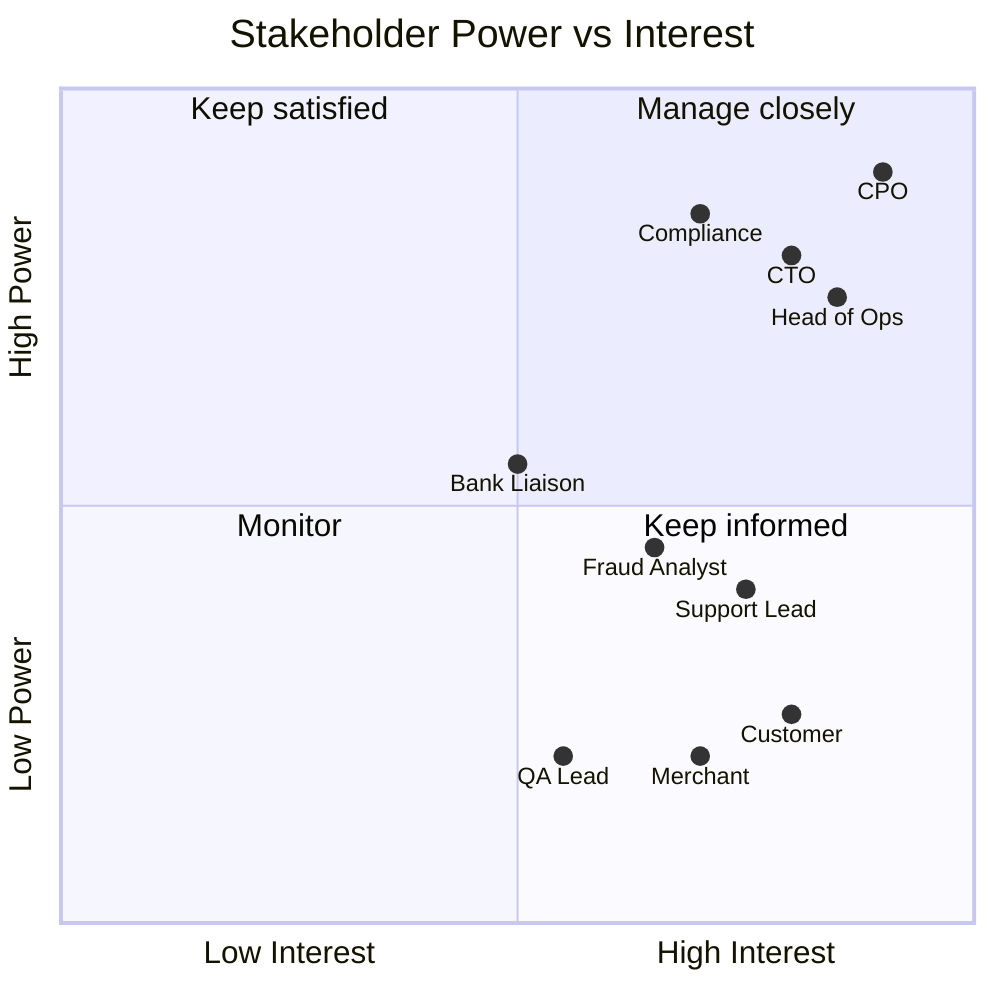

# Stakeholder Analysis

## Stakeholder register
| Stakeholder | Role | Interest / Need | Influence | Engagement |
|-------------|------|-----------------|-----------|------------|
| Chief Product Officer (sponsor) | Funds and approves scope | Growth, faster onboarding, roadmap delivery | High | Weekly steering update |
| Head of Operations | Owns support and reconciliation | Fewer tickets, automated reconciliation | High | Workshops, UAT sign-off |
| Compliance Officer | RBI/KYC and audit compliance | Regulatory adherence, audit trail | High | Review of all KYC/limit rules |
| CTO / Engineering Lead | Technical delivery | Feasible scope, clear NFRs | High | Refinement calls |
| Partner Bank Liaison | Settlement and UPI connectivity | Correct file formats, SLAs | Medium | Interface workshops |
| Customer Support Lead | Handles disputes | Self-service for refunds/disputes | Medium | Interviews, UAT |
| Fraud / Risk Analyst | Monitors suspicious activity | Rule configurability, alerts | Medium | Workshops |
| Retail Customer (end user) | Pays, transfers, tops up | Fast, safe, simple payments | Medium | Interviews, usability tests |
| Small Merchant (end user) | Accepts QR payments | Instant confirmation, settlement clarity | Medium | Interviews |
| QA Lead | Test planning | Testable, unambiguous requirements | Low | Review of acceptance criteria |

## Power / Interest grid

