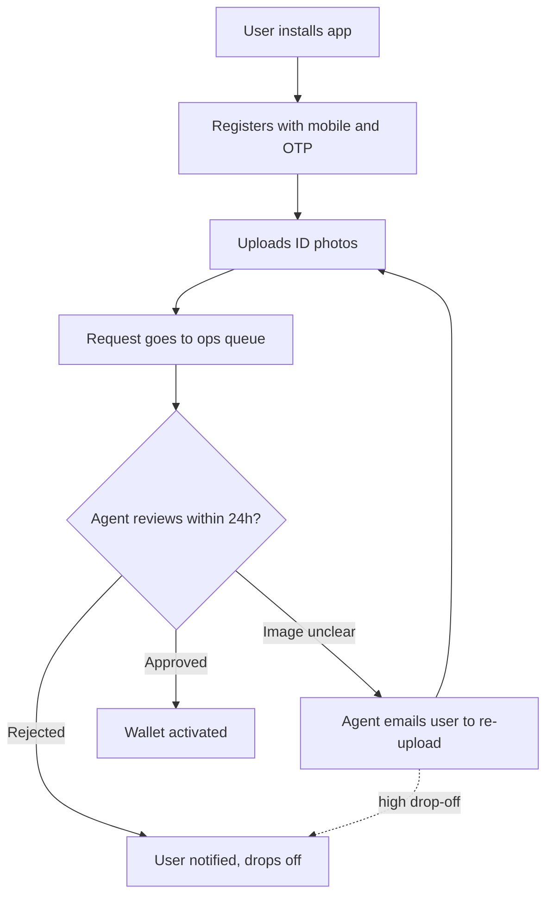
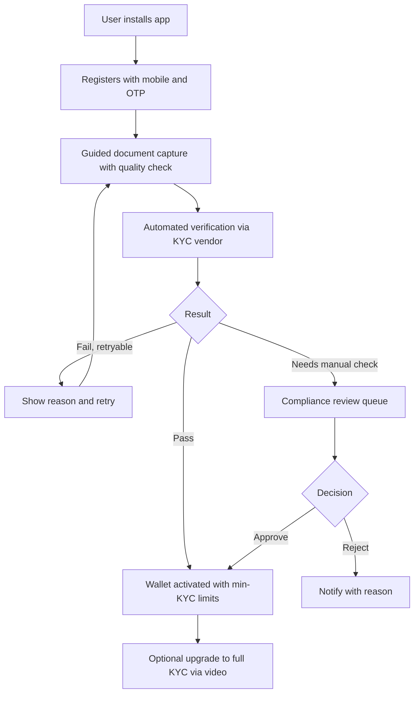
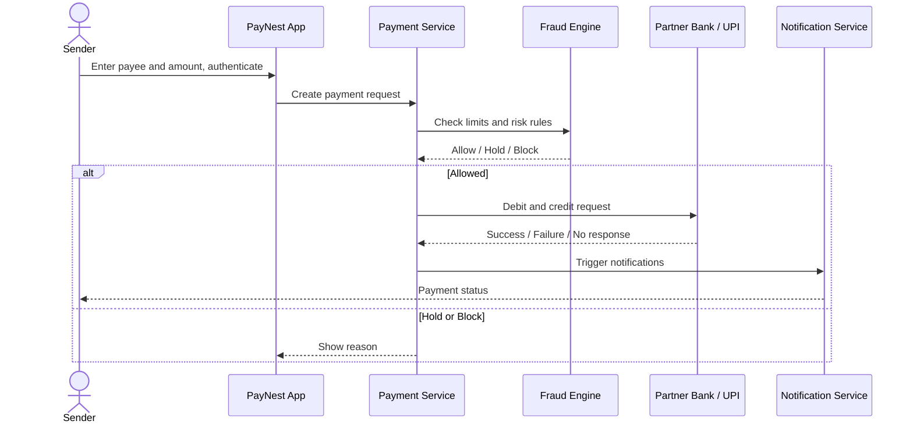
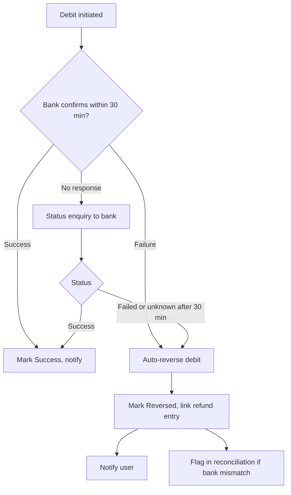

# Process Flows

## 1. As-is: onboarding and KYC (manual)

**Pain points:** up to 24-hour wait, unclear rejection reasons, repeated uploads, no real-time feedback.

## 2. To-be: onboarding and KYC (automated)

## 3. To-be: P2P payment sequence

## 4. To-be: failed-transaction auto-reversal

